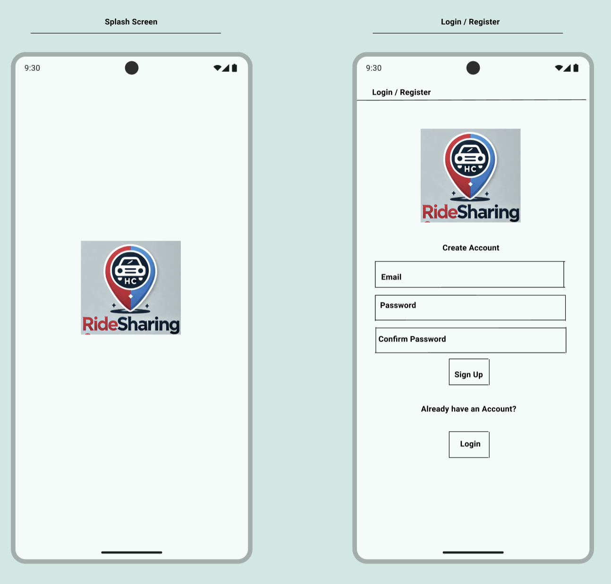
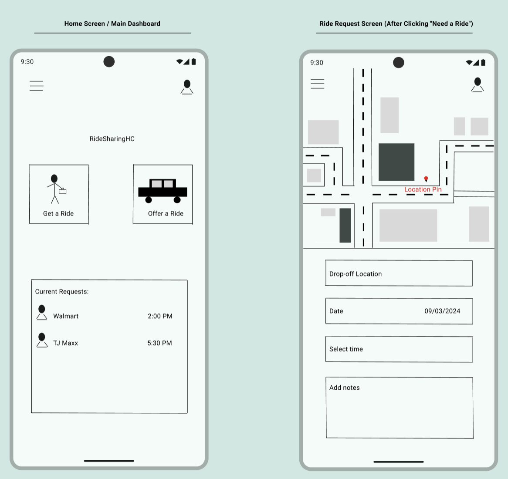
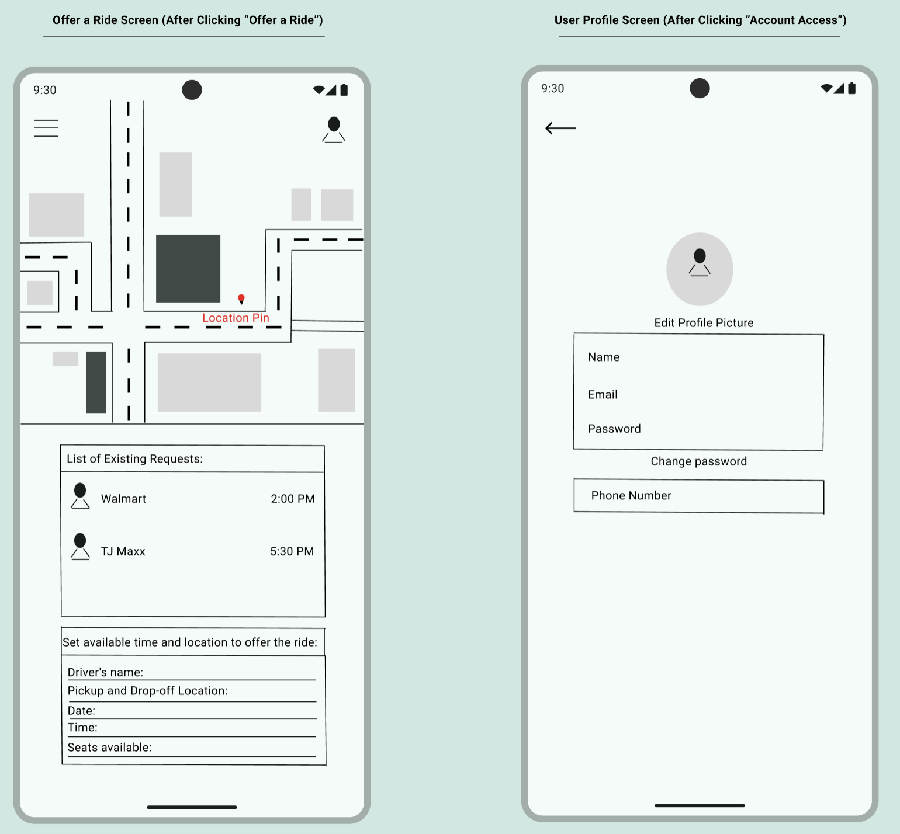
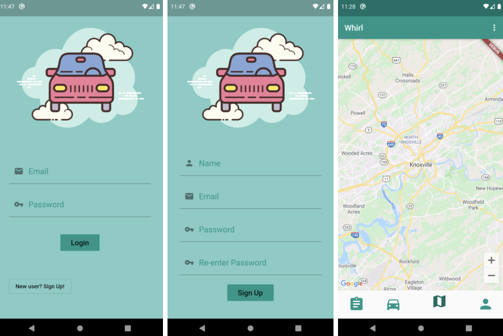
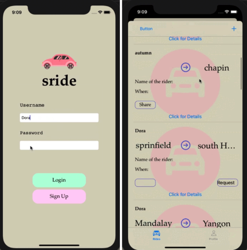

<button onclick="window.history.back()" class="back-button">← Back</button>

# Ridesharing App for College Community

## 1. Project Description

### Introduction:
This project involves the development of a mobile app designed to facilitate ridesharing within a college community. The app will provide a platform for students, faculty, and staff to offer and find rides to nearby locations.

As an international student without a car, I often face challenges in finding rides to places like Walmart, pharmacies, restaurants, and other essential locations. I believe that a ridesharing app could greatly simplify my life and the lives of other students who do not have cars. Additionally, such an app would help foster a stronger sense of community, encouraging people to assist one another and build connections within the college environment.

### Main Features:
- **User Authentication and Verification**: Secure sign-up and login process, with user verification tied to college credentials.
- **Ride Matching**: An intuitive interface for users to offer or request rides, with matching based on location and destination.
- **Rating and Review System**: Users can rate and review drivers and passengers to ensure a safe and reliable community.
- **In-App Communication**: Secure messaging system for drivers and passengers to coordinate pickup and drop-off details.
- **Map Integration**: Integration with Google Maps for real-time navigation, route planning, and distance calculation [1].

---

## 2. UI Mockups and Design

### Notebook Sketches
In the initial stages of design, I made use of hand-drawn sketches to brainstorm and visualize my app's UI. These sketches were created in my notebook and represent the first conceptualization of the app's interface, including the layout of screens, navigation flows, and key elements such as buttons, input fields, and maps.
Here are the images[2]:

#### **Splash Screen & Login/Register Screen**

The sketch for the **splash screen**, login, and registration screens is designed to make a great first impression by featuring an attractive logo against a background color that reflects the community's identity. The **login/registration screen** appears immediately after the splash screen, allowing new users to create an account or existing users to log in quickly and easily.

Additionally, the design of these screens is intended to be clean and simple, aiming to make the entry process into the app as smooth as possible for both new and returning users.

---

#### **Home Screen & Ride Request Screen**

The **home screen** serves as the central hub for users once they log in. It provides access to key features, such as finding a ride, offering a ride, and accessing user profiles. The screen also displays current ride requests, making it easy for users to see who needs a ride or who is offering one. Also, the **ride request screen** provides a streamlined interface for users to create and customize their ride requests. It allows users to specify the drop-off location, date, and time of the ride, making it easy to connect with available drivers who match their specific needs and preferences.

This design prioritizes ease of navigation and functionality, ensuring that users can quickly perform essential actions.

---

#### **Offer Ride Screen & User Profile Screen**

The **offer ride screen** enables drivers to set up ride offers by entering route details, available seats, and ride preferences. This screen is designed to simplify the process of sharing rides, making it easy for drivers to connect with potential riders based on their journey details.

The **user profile screen** allows users to manage their personal information, customize preferences, and adjust account settings. This screen is crucial for maintaining a personalized and secure experience for the users.

---

## 3. Comparable Existing Solutions

### Whirl Project on GitHub
Whirl is an open-source ridesharing app focused on private communities, making it relevant for comparison with my project idea[3]. It emphasizes user privacy and community-specific features, which align closely with the goals of this project. However, Whirl lacks specific features like student verification tied to college credentials and in-app communication, which are crucial for the college environment.

### Sride Project on GitHub
Sride is an open-source ridesharing app that focuses on community-based ridesharing [4]. While it offers features such as ride matching, user profiles, and scheduling, it is more generalized and does not cater specifically to college communities. My college-focused ridesharing app will build on these features, adding specific functionalities such as verification tied to college credentials.

### Kotlin Uber Clone by EDMT Dev
The "Kotlin Uber Clone" by EDMT Dev is a comprehensive YouTube tutorial series that walks developers through the entire process of building an Uber-like ridesharing app using Android Studio and Kotlin. The series covers a wide range of topics, from setting up the project and integrating user authentication to implementing real-time location tracking and ride-matching algorithms[5]. While this tutorial provides a strong foundation for building a ridesharing app, it lacks certain customizations that are essential for a college-specific environment, such as student verification and community-focused features.

---

## 4. Relevant Technologies and Tools

### Android SDK
- **Relation to my App**: The Android Software Development Kit is essential for developing any Android application, including my ridesharing app. It provides the tools, libraries, and documentation to build Android apps.
- **Description**: The Android SDK includes several development tools and APIs required for Android app development.
- **Key Features**:
  - Emulators and Debugging Tools: Allows testing the app on various Android devices without needing physical hardware(emulator). The SDK also includes powerful debugging tools to identify and fix issues during development.
  - Android APIs: Provides access to Android’s features, including telephony services, camera integration, and notification management.
  - Build Tools: The SDK also includes Gradle build tools.
- **Comparable Option**: Flutter SDK
  - Flutter is great to build for both Android and iOS, but since my focus is only on Android, the Android SDK is a better fit. It’s tailored specifically for Android apps, giving me access to all the native Android features I will need for ride tracking, notifications, and handling user interactions smoothly[6].

### Kotlin Programming Language
- **Relation to my App**: Kotlin is the preferred programming language for Android app development and is fully supported by Google. It is modern and designed to be fully interoperable with Java. For my ridesharing app, Kotlin offers concise syntax, which leads to reduced standard code, making development more efficient[7].
- **Description**: Kotlin is a statically typed programming language developed by JetBrains. It runs on the Java Virtual Machine (JVM) and can also be compiled into JavaScript, making it versatile for different platforms. Kotlin is known for its seamless integration with existing Java code, which is particularly useful in Android development.
- **Key Features**: Key features relevant to my project include:
  - Null Safety: Kotlin’s type system is designed to eliminate the danger of null pointer exceptions, which enhances the stability of the app.
  - Interoperability: Kotlin can easily interoperate with Java, allowing the use of existing Java libraries and frameworks within my app. This interoperability provides flexibility in selecting the best tools for different tasks. With access to a wide variety of libraries, Kotlin’s interoperability ensures that I can integrate the most suitable ones to meet the specific needs of my app.
- **Comparable Option**: Java
  - While Java is still a solid choice for Android development, Kotlin allows me to write more concise code, which is especially helpful for my app, as it needs to handle tasks like live location tracking and user interactions efficiently. Having worked with Kotlin during the Mobile Application Development course last Spring, I'm familiar with its strengths. Features like null safety and coroutines help reduce bugs, which is crucial for keeping the app stable[8].

### Firebase
- **Relation to my App**: Firebase is a platform that provides backend services like real-time databases, authentication, and analytics, which can help me with my ridesharing app[9].
- **Description**: Firebase offers tools that can handle many backend requirements, including real-time data syncing, push notifications, and secure authentication processes.
- **Key Features**: Key features relevant to my project include:
  - Firebase Authentication: Simplifies the process of user verification, email/password.
  - Cloud Firestore: A real-time NoSQL database that allows me to store and sync data for my app, ideal for managing rides and user interactions.
  - Firebase Cloud Messaging: Enables push notifications to keep users informed of ride requests and updates.
  - Firebase Cloud Storage: Firebase Cloud Storage is my choice for storing and serving user-generated content in my ridesharing app. It is basically built for app developers who need to store and serve user-generated content[10]
  - Firebase Authentication Integration: Provides secure access to files using Firebase Authentication, ensuring that only authorized users can access their content.
  - Automatic Scaling: As more users join the app, Firebase Cloud Storage automatically scales to accommodate the increased demand.
  - High Performance: Firebase Cloud Storage is optimized for high performance, which in my case is important for a good user experience.
- **Comparable Option**: AWS Amplify
  - Firebase is built with mobile apps in mind, making it a great fit for my ridesharing app, which needs real-time data sync for things like updating available rides and handling push notifications for ride confirmations. AWS Amplify is powerful and scalable, but Firebase's quick setup and easy integration with Android apps give it the edge, especially for a student project like mine where speed and ease of use matter[11].

### Jetpack Compose UI App Development Toolkit
- **Relation to my App**: Jetpack Compose is a toolkit for building native Android UI, offering a more declarative approach to designing user interfaces. It allows for more concise and readable code, which can speed up the development process and improve UI consistency across the app. Given that my ridesharing app will require a responsive and user-friendly interface, Jetpack Compose can be highly relevant[12].
- **Description**: UI toolkit by Google designed for building native Android applications using Kotlin. It allows developers to create user interfaces using a declarative programming model, what I understand from the documentation and research is that UI elements are defined in terms of how they should look based on their current state. 
- **Key Features**:
  - Declarative UI: Allows developers to describe the UI in Kotlin code, leading to more expressive UI components. This can speed up my project development.
  - Integration with Android: Fully compatible with existing Android views and Jetpack libraries.
  - State Management: Simplifies the handling of UI state changes.
  - Performance: It sounds like it is designed to offer high performance.
- **Comparable Option**: Flutter UI Framework
  - While Flutter allows for building cross-platform apps with a single codebase, Jetpack Compose is specifically designed for native Android development, making it more efficient for my ridesharing app. Compose integrates deeply with Android’s ecosystem, giving me access to Android-specific APIs and components, which are crucial for features that I will need to use in my app. Although Flutter is great for multi-platform apps, Compose is the better choice for my app[13].

---

## 6. References
Using [IEEE style](https://libguides.murdoch.edu.au/IEEE) for bibliographical references:
- [1] Google, "Google Maps SDK for Android," Google. https://developers.google.com/maps/documentation/android-sdk/overview (accessed Sept. 2, 2024).

- [2] Figma, "Figma - Android UI Kit," Figma. https://www.figma.com/community/file/1237551184114564748 (accessed Sept. 17, 2024).

- [3] GitHub, "Whirl Project," Github, Whirl, 2020. https://github.com/cs340-20/Whirl (accessed Sept. 3, 2024).

- [4] GitHub, "Sride Project," Github, Sride, 2022. https://github.com/AuYuRa/sride?tab=readme-ov-file (accessed Sept. 3, 2024).

- [5] EDMT Dev, "Kotlin Uber Clone YouTube Playlist," YouTube, EDMT Dev, 2020. https://youtube.com/playlist?list=PLaoF-xhnnrRW4HZNwZZ6MS12aWn-m3nGd&si=egE4xzk3ETiClZFg. (accessed Sept. 6, 2024).

- [6] Google, "Flutter Documentation," Flutter. https://docs.flutter.dev/ (accessed Sept. 17, 2024).

- [7] JetBrains, "Kotlin for Android Developers," Kotlin Help. https://kotlinlang.org/docs/android-overview.html (accessed Sept. 4, 2024).

- [8] GeeksforGeeks, "Learn Java for Android App Development - A Complete Guide," GeeksforGeeks. https://www.geeksforgeeks.org/learn-java-for-android-app-development-a-complete-guide/ (accessed Sept. 17, 2024).

- [9] Google, "Firebase for Android," Firebase. https://firebase.google.com/docs/android/setup (accessed Sept. 4, 2024).

- [10] Google, "Get Started with Cloud Storage on Android," Firebase. https://firebase.google.com/docs/storage/android/start (accessed Sept. 13, 2024).

- [11] AWS, "AWS Amplify Documentation," AWS. https://docs.amplify.aws/ (accessed Sept. 17, 2024).

- [12] Google, "Jetpack Compose," Android Developers. https://developer.android.com/compose (accessed Sept. 5, 2024).

- [13] Google, "Flutter UI Overview," Flutter. https://docs.flutter.dev/ui (accessed Sept. 18, 2024).