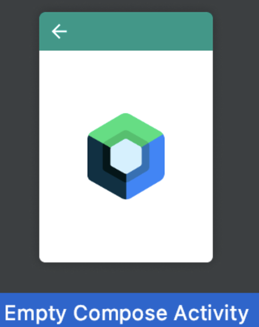

# **Setting Up Jetpack Compose**

To get started with **Jetpack Compose** in Android Studio, follow the steps below:

### 🛠️ **Step 1: Open Android Studio**
Make sure you have the **latest version of Android Studio** installed. If not, you can download it here:

- [**Download Android Studio**](https://developer.android.com/studio)

### 🧑‍💻 **Step 2: Create a New Project**

1. Open Android Studio and select **"Create a New Project"**.
2. In the templates list, choose **"Empty Compose Activity"**. This template will set up the basic files needed to start using Jetpack Compose right away.



3. Name your project and configure your package details.

### 🗂️ **Step 3: Check Your Dependencies**
Ensure that your project includes the necessary **Jetpack Compose** dependencies in your `build.gradle` file. Navigate to your project’s `build.gradle` file and confirm that the following dependencies are present:

Kotlin:
```
dependencies {
    implementation("androidx.compose.ui:ui:1.0.0")
    implementation("androidx.compose.material:material:1.0.0")
    implementation("androidx.compose.ui:ui-tooling-preview:1.0.0")
    implementation("androidx.lifecycle:lifecycle-runtime-ktx:2.3.1")
},
```

Make sure to sync your project after adding or updating these dependencies. If you need more details on how to manage dependencies, check out the official documentation:

- [**Gradle Dependencies Guide**](https://developer.android.com/build/dependencies)

---

### 🚀 **Step 4: Sync Your Project**
Once your dependencies are updated, hit the **"Sync Now"** button in Android Studio to ensure everything is set up correctly.

---

### 📚 **Resources for Setting Up Jetpack Compose**
If you’re encountering any issues or need more information, here are some helpful resources:

- [**Jetpack Compose Documentation**](https://developer.android.com/jetpack/compose)
- [**How to Create a New Jetpack Compose Project**](https://developer.android.com/jetpack/compose/setup)
- [**Gradle Setup for Compose**](https://developer.android.com/develop/ui/compose/compiler)

---

With everything set up, you're now ready to start designing your UI with Jetpack Compose! Continue to **[Basic Composables](basic_composables.md)** .
