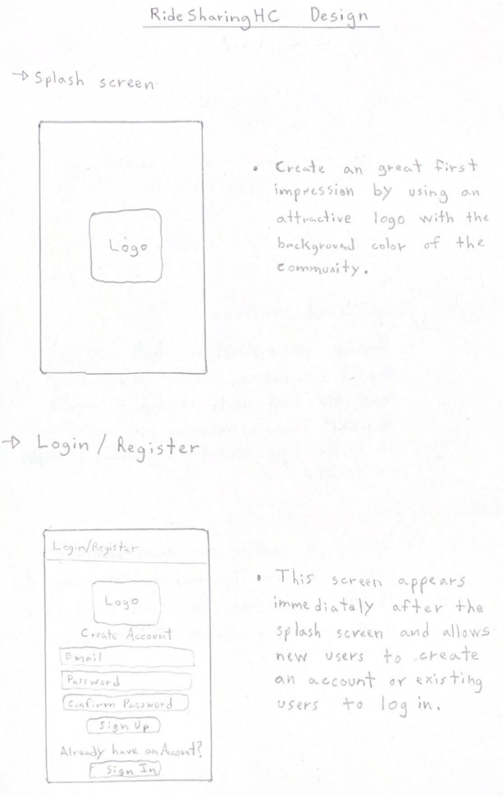
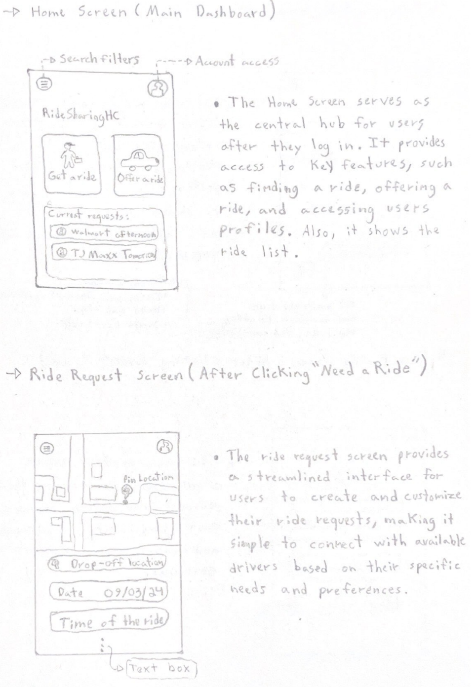
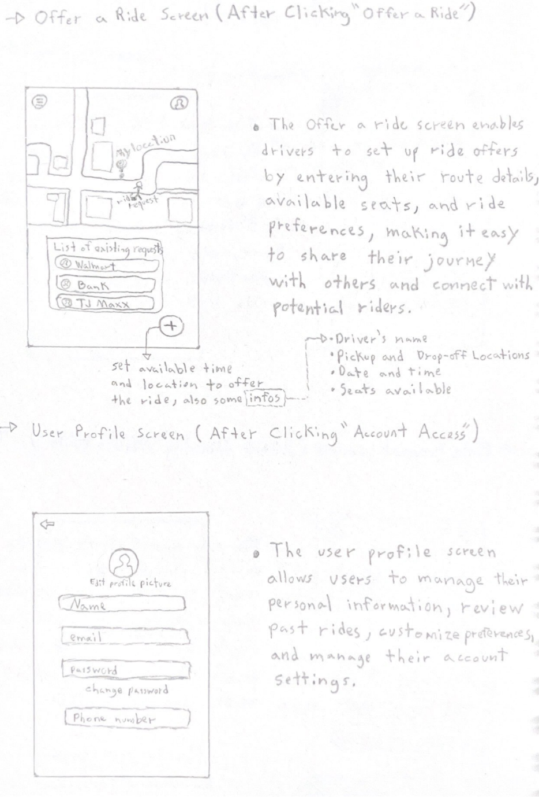

# Ridesharing App for College Community

## 1. Project Description

### Introduction:
This project involves the development of a mobile app designed to facilitate ridesharing within a college community. The app will provide a platform for students, faculty, and staff to offer and find rides to nearby locations. As an international student without a car, I often face challenges in finding rides to places like Walmart, pharmacies, restaurants, and other essential locations. I believe that a ridesharing app could greatly simplify my life and the lives of other students who do not have cars. Additionally, such an app would help foster a stronger sense of community, encouraging people to assist one another and build connections within the college environment.

### Main Features:
- **User Authentication and Verification**: Secure sign-up and login process, with user verification tied to college credentials.
- **Ride Matching**: An intuitive interface for users to offer or request rides, with matching based on location and destination.
- **Rating and Review System**: Users can rate and review drivers and passengers to ensure a safe and reliable community.
- **In-App Communication**: Secure messaging system for drivers and passengers to coordinate pickup and drop-off details.
- **Map Integration**: Integration with Google Maps for real-time navigation, route planning, and distance calculation [1].

## 4. UI Mockups and Design

### Notebook Sketches
In the initial stages of design, I also made use of hand-drawn sketches to brainstorm and visualize my app's UI. These sketches were created in my notebook and represent the first conceptualization of the app's interface, including the layout of screens, navigation flows, and key elements such as buttons, input fields, and maps.
Here are the images:
- *Image 1*: Concept for the splash screen, login, and registration screens.

- *Image 2*: Initial concept for the home screen, including options to offer or request a ride.

- *Image 3*: Sketch of the offer ride screen and user profile screen.

  
## 3. Comparable Existing Solutions

### Whirl Project on GitHub
Whirl is an open-source ridesharing app focused on private communities, making it relevant for comparison with my project idea[2]. It emphasizes user privacy and community-specific features, which align closely with the goals of this project. However, Whirl lacks specific features like student verification tied to college credentials and in-app communication, which are crucial for the college environment.

### Sride Project on GitHub
Sride is an open-source ridesharing app that focuses on community-based ridesharing [3]. While it offers features such as ride matching, user profiles, and scheduling, it is more generalized and does not cater specifically to college communities. My college-focused ridesharing app will build on these features, adding specific functionalities such as verification tied to college credentials.

### Kotlin Uber Clone by EDMT Dev
The "Kotlin Uber Clone" by EDMT Dev is a comprehensive YouTube tutorial series that walks developers through the entire process of building an Uber-like ridesharing app using Android Studio and Kotlin. The series covers a wide range of topics, from setting up the project and integrating user authentication to implementing real-time location tracking and ride-matching algorithms[4]. While this tutorial provides a strong foundation for building a ridesharing app, it lacks certain customizations that are essential for a college-specific environment, such as student verification and community-focused features. For all that, the tutorial is a valuable resource for understanding the technical stack and development practices necessary for my project.

## 4. Relevant Technologies and Tools

### Android SDK
- **Relation to my App**: The Android Software Development Kit is essential for developing any Android application, including my ridesharing app. It provides the tools, libraries, and documentation to build Android apps.
- **Description**: The Android SDK includes several development tools and APIs required for Android app development.
- **Key Features**:
  - Emulators and Debugging Tools: Allows testing the app on various Android devices without needing physical hardware(emulator). The SDK also includes powerful debugging tools to identify and fix issues during development.
  - Android APIs: Provides access to Android’s features, including telephony services, camera integration, and notification management.
  - Build Tools: The SDK also includes Gradle build tools.

### Kotlin Programming Language
- **Relation to my App**: Kotlin is the preferred programming language for Android app development and is fully supported by Google. It is modern and designed to be fully interoperable with Java. For my ridesharing app, Kotlin offers concise syntax, which leads to reduced standard code, making development more efficient[5].
- **Description**: Kotlin is a statically typed programming language developed by JetBrains. It runs on the Java Virtual Machine (JVM) and can also be compiled into JavaScript, making it versatile for different platforms. Kotlin is known for its seamless integration with existing Java code, which is particularly useful in Android development.
- **Key Features**: Key features relevant to my project include:
  - Null Safety: Kotlin’s type system is designed to eliminate the danger of null pointer exceptions, which enhances the stability of the app.
  - Interoperability: Kotlin can easily interoperate with Java, allowing the use of existing Java libraries and frameworks within my app. This interoperability provides flexibility in selecting the best tools for different tasks. With access to a wide variety of libraries, Kotlin’s interoperability ensures that I can integrate the most suitable ones to meet the specific needs of my app.

### Firebase
- **Relation to my App**: Firebase is a platform that provides backend services like real-time databases, authentication, and analytics, which can help me with my ridesharing app[6].
- **Description**: Firebase offers tools that can handle many backend requirements, including real-time data syncing, push notifications, and secure authentication processes.
- **Key Features**: Key features relevant to my project include:
  - Firebase Authentication: Simplifies the process of user verification, email/password.
  - Cloud Firestore: A real-time NoSQL database that allows me to store and sync data for my app, ideal for managing rides and user interactions.
  - Firebase Cloud Messaging: Enables push notifications to keep users informed of ride requests and updates.

 ### Jetpack Compose UI App Development Toolkit
- **Relation to my App**: Jetpack Compose is a toolkit for building native Android UI, offering a more declarative approach to designing user interfaces. It allows for more concise and readable code, which can speed up the development process and improve UI consistency across the app. Given that my ridesharing app will require a responsive and user-friendly interface, Jetpack Compose can be highly relevant[7].
- **Description**: UI toolkit by Google designed for building native Android applications using Kotlin. It allows developers to create user interfaces using a declarative programming model, what I understand from the documentation and research is that UI elements are defined in terms of how they should look based on their current state. 
- **Key Features**:
  - Declarative UI: Allows developers to describe the UI in Kotlin code, leading to more expressive UI components. This can speed up my project development.
  - Integration with Android: Fully compatible with existing Android views and Jetpack libraries.
  - State Management: Simplifies the handling of UI state changes.
  - Performance: It sounds like it is designed to offer high performance.

## 5. References
Using [IEEE style](https://libguides.murdoch.edu.au/IEEE) for bibliographical references:
- [1] Google, "Google Maps SDK for Android," https://developers.google.com/maps/documentation/android-sdk/overview (accessed Sept. 2, 2024).
- [2] GitHub, "Whirl Project," https://github.com/cs340-20/Whirl (accessed Sept. 3, 2024).
- [3] GitHub, "sride Project," https://github.com/AuYuRa/sride?tab=readme-ov-file (accessed Sept. 3, 2024).
- [4] EDMT Dev, "Kotlin Uber Clone YouTube Playlist," https://youtube.com/playlist?list=PLaoF-xhnnrRW4HZNwZZ6MS12aWn-m3nGd&si=egE4xzk3ETiClZFg (accessed Sept. 6, 2024).
- [5] JetBrains, "Kotlin for Android Developers," https://kotlinlang.org/docs/android-overview.html (accessed Sept. 4, 2024).
- [6] Google, "Firebase for Android," https://firebase.google.com/docs/android/setup (accessed Sept. 4, 2024).
- [7] Google, "Jetpack Compose," https://developer.android.com/compose (accessed Sept. 5, 2024).
